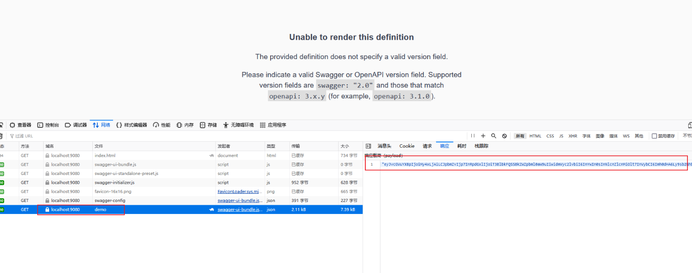
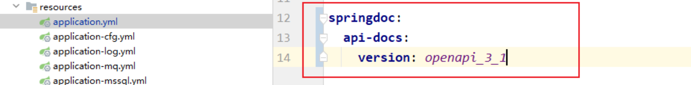
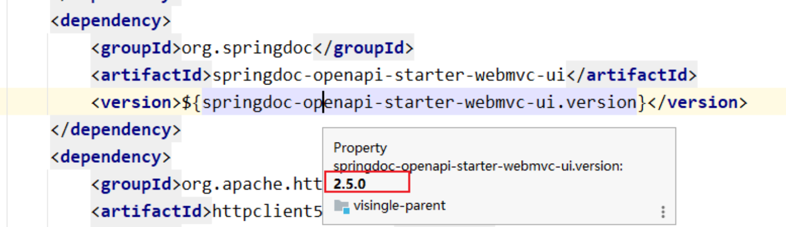
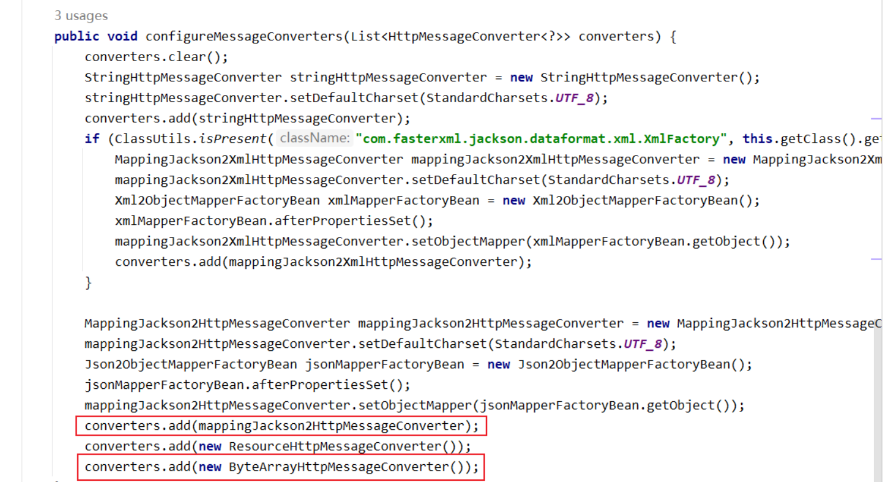
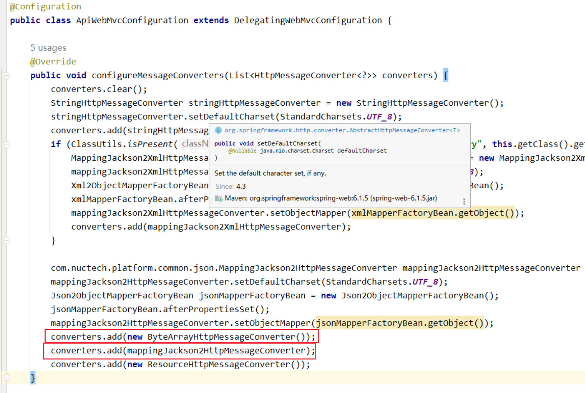
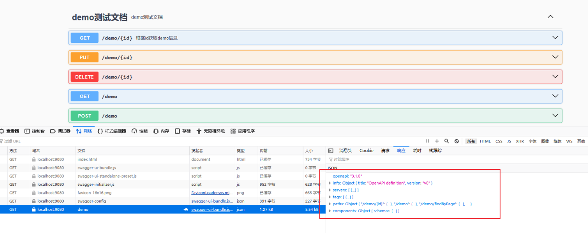

# SpringBoot3.2.5集成OpenAPI遇到的问题

SpringBoot3.2.5 集成最新的 springdoc-openapi 后写了个 demo 测试之后发现了不兼容的情况，查看接口发现demo 的返回是一串 Base64 位编码的字符串，并没有解析成 json 格式的内容。

按照报错页面的提示将 openapi 也升级到 3.1 的版本也无济于事

网上查找发现有可能是因为 `ByteArrayHttpMessageConverter()` 和 `MappingJackson2HttpMessageConverter()` 两个coverter 添加的顺序出现的问题，前者必须在后者之前添加。
[Malformed \(base64 encoded\) api-docs JSON when MappingJackson2HttpMessageConverter is active · Issue \#2143 · springdoc/springdoc-openapi](https://github.com/springdoc/springdoc-openapi/issues/2143)
查看公司框架源码发现，两者的添加循序正好反了。就写了一个方法覆盖了公司的源码，第一张图片是公司源码，第二张图片是自己写的 configuration 配置类。

启动项目后发现接口中的数据就解析正常了，接口信息页面也就显示正常了。
